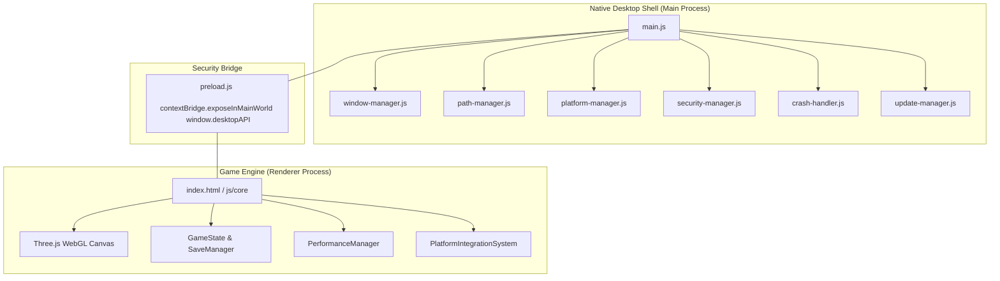

# The Whispering Wilds - Desktop Platform Architecture

## Executive Summary
*The Whispering Wilds* (`Kaattu Vazhi / Thadam`) is delivered as a native, cross-platform PC application supporting **Windows**, **macOS**, and **Linux** across both **x64** and **ARM64** architectures.

The desktop runtime utilizes an **Electron shell** providing native OS window management, hardware capability introspection, secure IPC, native file system persistence, and crash resiliency while preserving the core **HTML5 / CSS / Three.js WebGL** single-codebase frontend.

---

## Architecture Overview

### Core Invariants
1. **One Game Codebase**: The exact same `index.html`, `css/`, `js/`, and `assets/` power browser development and desktop distribution on Windows, macOS, and Linux. No platform-specific frontend forks (`windows/index.html`, etc.).
2. **Process Boundary & State Authority**:
   - **Main Process** owns: Window lifecycle, paths, power state, single instance lock, update staging, crash handling, and IPC routing. Main process **never** owns player position, quests, inventory, NPC simulation, weather, or GameState.
   - **Renderer Process** owns: Three.js rendering, UI, GameState, audio, and gameplay logic.
3. **Strict Context Isolation & Zero Node in Renderer**:
   - `nodeIntegration: false`, `contextIsolation: true`.
   - Renderer interacts solely through the secure `window.desktopAPI` bridge.
   - No direct access to `require`, `fs`, `child_process`, or Node globals.
4. **Data Separation**:
   - `GAME_INSTALL_DATA`: Immutable, read-only game binaries and packaged local assets.
   - `USER_DATA`: OS-standard writable directories (`%APPDATA%`, `~/Library/Application Support`, `~/.config`) housing saves, settings, logs, screenshots, and cache. Saves are **never** stored beside game binaries.
5. **Absolute Customization Ceiling**:
   - `0 <= window.GameState.player.customizationChangesUsed <= 5` is strictly enforced and audited across all saves, IPC calls, and updates.

---

## Windowing, Display & Resolutions
- **Window Modes**: `WINDOWED`, `BORDERLESS`, and `FULLSCREEN`.
- **Supported Standard Resolutions**:
  - 1280x720 (720p 16:9)
  - 1366x768 (16:9 Laptop)
  - 1600x900 (900p 16:9)
  - 1920x1080 (1080p Full HD)
  - 2560x1440 (1440p QHD)
  - 3840x2160 (4K UHD)
  - 2560x1080 & 3440x1440 (21:9 Ultrawide)
  - 1920x1200 (16:10 Laptop/Monitor)
- **High-DPI & DPR Capping**: Dynamically reads display scale factors and caps rendering device pixel ratios via `PerformanceManager` to prevent GPU buffer exhaustion on weak hardware.
- **Multi-Monitor Resiliency**: Listens for display configuration changes and re-evaluates viewport and UI bounds without recreating world or scene state. Automatic recovery for off-screen windows.
- **Alt-Tab & Focus Management**: Pauses single-player gameplay, resets transient inputs (clears key presses, mouse holds, sprint flags), and throttles background work when minimized.
