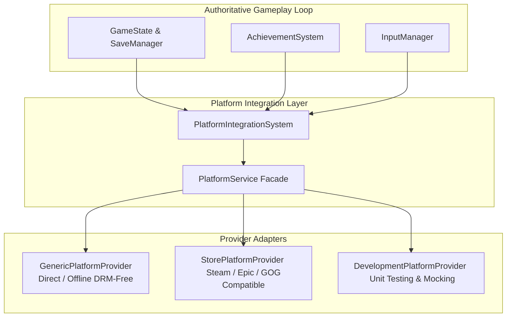

# The Whispering Wilds - Storefront & Platform Integration Architecture

## Overview
*The Whispering Wilds* (`Kaattu Vazhi / Thadam`) uses an adapter-based architecture for PC storefront integration. The game is never hardcoded or locked to a single storefront ecosystem (such as Steam, Epic Games Store, or GOG).

---

## Authority & Provider Architecture

### Core Architecture Principles
1. **Single Authoritative Manager**: `PlatformIntegrationSystem` is the single point of entry connecting game systems to external platform services.
2. **Providers as Adapters**:
   - `GenericPlatformProvider`: Standalone direct release, DRM-free, zero network/store requirement.
   - `StorePlatformProvider`: Standardized adapter for Steam/Epic/GOG integrations.
   - `DevelopmentPlatformProvider`: Test mock simulating offline/cloud failures.
3. **100% Offline Gameplay Autonomy**:
   - Single-player exploration, quests, dialog, inventory, and local saves never require storefront connectivity.
   - If a storefront service fails or disconnects, gameplay continues completely unimpeded.
4. **Zero Credential Collection**:
   - Under no circumstances does the game collect, prompt for, or store storefront passwords, secret keys, or authentication tokens.
5. **Absolute Customization Ceiling**:
   - Player customization ceiling (`0 <= customizationChangesUsed <= 5`) is enforced before and after any cloud sync, achievement unlock, or platform event.
