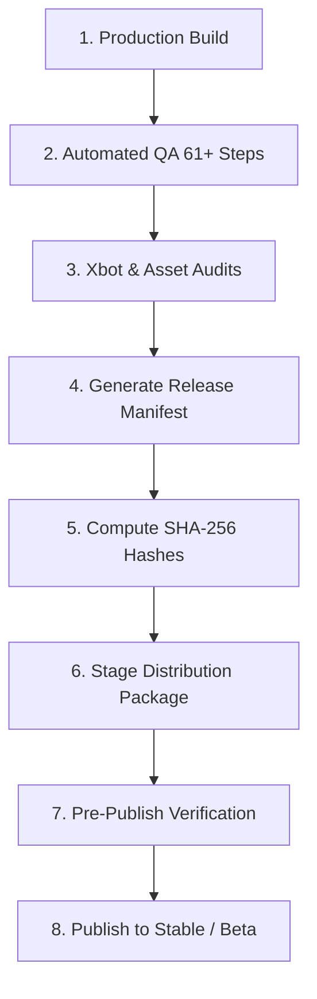

# Production Release Pipeline & Publishing Process
## Project: The Whispering Wilds (`Kaattu Vazhi`)

---

## 1. Release Flow Stages

Every production build passes through an uncompromised automated release gate:

### 1. Build Verification
- Code minification and bundle consolidation.
- Exclusion of developer cheats (`teleport`, `forceQuest`, performance emulation).
- Embedded version constants (`GAME_VERSION`, `BUILD_ID`, `ASSET_VERSION`, `SAVE_SCHEMA_VERSION = 3`).

### 2. Asset Integrity Audits
- **Player Character Audit**: Verifies `assets/characters/player/player.glb` exists locally and is valid. Rejects any reference to `Xbot` or external demo CDNs.
- **Placeholder Asset Audit**: Blocks release if any critical asset is marked as `PLACEHOLDER`.
- **External Dependency Scan**: Ensures no runtime dependency on unstable third-party CDNs.

### 3. Release Manifest Generation
- Generates `release-manifest.json` with version metadata, required disk space, and full file list with cryptographic SHA-256 signatures.

### 4. Release Gate Enforcement
The release gate will **UNCONDITIONALLY BLOCK** publishing if:
- Any automated regression test fails.
- SHA-256 checksum mismatches.
- Player customization ceiling is not strictly bounded (`0 <= customizationChangesUsed <= 5`).
- Save schema compatibility is undefined.
